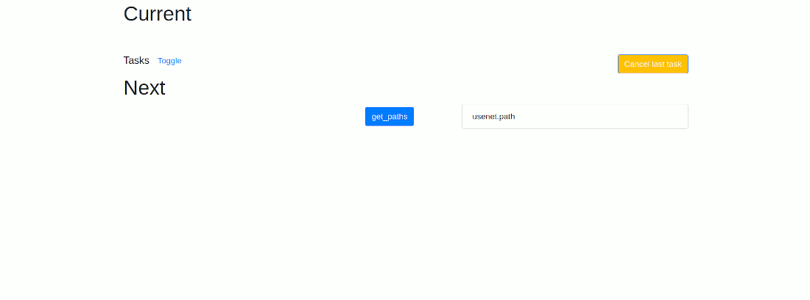

# Frame Tasks

Utility for performing tasks on dataframes.

 Screenshots


## Requires

A message queue is required that can work with Celery (i.e. RabbitMQ).

## Usage

Get this repo and install in current env: `pip install .`

Start a celery worker:

```bash
CELERY_BROKER_URL="amqp://..." celery -A frame_tasks.serve.celery worker -l info
```

Start the ui:

```bash
CELERY_BROKER_URL="amqp://..." FLASK_APP=frame_tasks.serve_all flask run --port=5000
```

Browse the url `http://localhost:5000/explore`
